# NorthGate VM Factory

Private, Git-backed desired-state and governance repository for the NorthGate Windows Server 2022 Hyper-V lab.

> **Safety status: plan-only.** This repository does not authorize VM creation or modification. Apply stays disabled until control-plane hardening, a read-only planner, and canary acceptance are independently verified.

## Architecture map

```mermaid
flowchart LR
    Owner["Infrastructure owner"] --> Codex["Codex<br/>author and validate"]

    subgraph GitHub["GitHub trust boundary - private repository"]
        PR["Manifest or policy PR"]
        CI["Hosted static validation<br/>no lab route or credentials"]
        Review["Human review and merge"]
        Commit["Approved repository identity<br/>merged commit and tree"]
        PR --> CI --> Review --> Commit
    end

    Codex --> PR

    subgraph Workstation["Authorized management workstation"]
        Fetcher["Fixed data-only fetcher<br/>no hooks, filters, or repo code"]
        Planner["Installed signed planner"]
        Approval["Human approval<br/>host plan ID and signed hash"]
        Executor["Installed signed executor"]
        CredentialStore["Protected credential store<br/>dedicated service identity"]
        Tunnel["Forwarding-only encrypted tunnel<br/>application authentication"]
        Collector["Receipt collector"]
        Fetcher --> Planner
        Approval --> Executor
        CredentialStore --> Fetcher
        CredentialStore --> Executor
        Executor --> Tunnel
        Tunnel --> Collector
    end

    Commit --> Fetcher

    subgraph Host["NorthGate Hyper-V trust boundary"]
        ReadOnly["Read-only MCP inventory"]
        PlanRegistry["Canonical plan registry<br/>expiry, state binding, host lock"]
        Apply["Plan-gated MCP apply<br/>plan ID only"]
        Provisioner["Installed provisioner<br/>authoritative server policy"]
        HyperV["Native Hyper-V PowerShell"]
        VMs["Managed Generation 2 VMs"]
        Audit["Protected audit log"]
        ReadOnly --> PlanRegistry
        Apply --> PlanRegistry --> Provisioner --> HyperV --> VMs
        Apply --> Audit
    end

    Planner -->|"normalized read set"| Tunnel
    Tunnel --> ReadOnly
    Planner -->|"canonical post-merge plan"| PlanRegistry
    PlanRegistry -->|"accepted plan ID, signed hash, expiry"| Approval
    Tunnel --> Apply

    subgraph Records["Governance and evidence boundary"]
        Receipt["Signed execution receipt<br/>before and after hashes"]
        Vault["Operation-SeeSaw<br/>system of record"]
        Receipt --> Vault
    end

    Apply --> Receipt
    Audit --> Receipt
    Collector --> Receipt
    Owner -. "separate Administrator identity - break-glass only" .-> Host
```



The canonical explanation of trust boundaries, authorization, data flow, and failure behavior is in [docs/architecture.md](docs/architecture.md).

## Core rules

- Git stores reviewed intent; Git never provisions Hyper-V by itself.
- A deployment plan is produced after merge and binds the immutable repository identity, merged commit and tree, canonical manifest, normalized live state, policy, image, and installed executor versions.
- The host independently validates the canonical plan, registers it, and returns an expiring plan ID with an authenticated hash. Apply submits that plan ID only.
- Codex may author, validate, plan, and invoke an approved apply. It is not an independent approver.
- Repository contents are untrusted data at the privileged boundary. The executor never runs checkout scripts, hooks, submodules, filters, or binaries.
- Routine provisioning uses a dedicated forwarding identity and plan-gated MCP operation. Administrator SSH is separate and reserved for bootstrap or break-glass recovery.
- No GitHub Actions runner, Git credential, or repository checkout is installed on the Hyper-V host.
- No secret, private key, password, token, generated unattend credential, live plan, receipt, identity ledger, or Terraform state enters this repository.
- Removing or renaming a manifest only reports drift. It never implies replacement, decommission, disk deletion, or purge.

## Repository layout

```text
catalog/                    Approved opaque references; host mapping remains authoritative
docs/                       Architecture, governance, acceptance tests, and decision records
manifests/vms/              Managed VM desired state; intentionally empty initially
policy/                     Proposed plan-only resource and action policy
schemas/                    Strict JSON Schema 2020-12 contracts
scripts/                    Unprivileged repository validation only
.github/                    CODEOWNERS, PR template, and hosted static validation
```

## Validate locally

From Windows PowerShell or PowerShell 7:

```powershell
./scripts/Test-Repository.ps1
```

PowerShell 7 also performs JSON Schema validation. Windows PowerShell 5.1 performs the portable structural, reference, identity, secret-pattern, and safety checks.

## Rollout state

1. **Current:** private repository bootstrap and plan-only controls.
2. **Next:** harden MCP code and audit ACLs, establish separate tunnel/application identities, reconcile releases, and build normalized read-only planning.
3. **Then:** prove one disposable canary with stale-plan, capacity, collision, concurrency, secret, path, identity, and rollback tests.
4. **Later:** promote image construction, guest bootstrap, drift reporting, and narrowly scoped low-risk automation.

See [the acceptance gates](docs/acceptance-tests.md), [the manifest contract](docs/manifest-contract.md), and [ADR-0001](docs/decision-records/ADR-0001-gitops-lite.md). Live assessment evidence and environment-specific mappings remain off Git in Operation-SeeSaw.
