# NorthGate VM Factory

Publicly inspectable, Git-backed desired-state and governance source for the NorthGate Windows Server 2022 Hyper-V lab.

This repository demonstrates guarded infrastructure automation, explicit trust boundaries, and reproducible validation. Public source availability is not deployment authorization or a production-readiness claim. See the [public source decision](docs/decision-records/ADR-0009-public-source-visibility.md) for the scope of the owner-authorized publication.

> **Safety status: approved source, host activation blocked.** This repository contains an approved create-only source policy and exact fleet promotion, including source `applyEnabled: true`. Those values support release construction and review; they are not proof of installed host policy and do not authorize VM creation or modification. Apply remains blocked until the matching signed release, constrained identity, ledger/registry, host lock, exact plan approval, and live collision checks are installed and verified.

## Architecture map

```mermaid
flowchart LR
    Owner["Infrastructure owner"] --> Codex["Codex<br/>author and validate"]

    subgraph GitHub["GitHub trust boundary - public source repository"]
        PR["Manifest or policy PR"]
        CI["Hosted static validation<br/>no lab route or credentials"]
        Review["Human review and merge"]
        Commit["Approved repository identity<br/>merged commit and tree"]
        PR --> CI --> Review --> Commit
    end

    Codex --> PR

    subgraph Workstation["Authorized management workstation"]
        Fetcher["Fixed data-only fetcher<br/>no hooks, filters, or repo code"]
        Planner["Installed signed planner"]
        Approval["Human approval<br/>host plan ID and signed hash"]
        Executor["Fixed create-only client"]
        CredentialStore["Protected create-only SSH key"]
        Collector["Receipt collector"]
        Fetcher --> Planner
        Approval --> Executor
        CredentialStore --> Executor
        Executor --> Collector
    end

    Commit --> Fetcher

    subgraph Host["NorthGate Hyper-V trust boundary"]
        Forced["Source-restricted forced command<br/>status / plan / apply / receipt"]
        PlanRegistry["Canonical plan registry<br/>expiry, state binding, host lock"]
        ApprovalWriter["Administrator-only<br/>exact approval writer"]
        Provisioner["Installed provisioner<br/>authoritative server policy"]
        HyperV["Native Hyper-V PowerShell"]
        VMs["Managed Generation 2 VMs"]
        Audit["Protected audit log"]
        Legacy["Existing NorthGateMCP<br/>separate operational / transition plane"]
        Forced --> PlanRegistry --> Provisioner --> HyperV --> VMs
        ApprovalWriter --> PlanRegistry
        PlanRegistry --> Audit
    end

    Planner -->|"fixed asset request"| Executor
    Executor -->|"pinned public-key SSH"| Forced
    PlanRegistry -->|"accepted plan ID, signed hash, expiry"| Approval
    Owner -->|"separate Administrator identity"| ApprovalWriter

    subgraph Records["Governance and evidence boundary"]
        Receipt["Signed execution receipt<br/>before and after hashes"]
        Vault["Operation-SeeSaw<br/>system of record"]
        Receipt --> Vault
    end

    PlanRegistry --> Receipt
    Audit --> Receipt
    Collector --> Receipt
    Owner -. "break-glass only" .-> Legacy
```



The canonical explanation of trust boundaries, authorization, data flow, and failure behavior is in [docs/architecture.md](docs/architecture.md).

## Core rules

- Git stores reviewed intent; Git never provisions Hyper-V by itself.
- Source `applyEnabled` is not installed apply authority. Repository validation proves source consistency; only host readback can prove active policy and runtime state.
- A deployment plan is produced after merge and binds the immutable repository identity, merged commit and tree, canonical manifest, normalized live state, policy, image, and installed executor versions.
- The host independently validates the canonical plan, registers it, and returns an expiring plan ID with an authenticated hash. Apply submits that plan ID only.
- Codex may author, validate, plan, and invoke an approved apply. It is not an independent approver.
- Repository contents are untrusted data at the privileged boundary. The executor never runs checkout scripts, hooks, submodules, filters, or binaries.
- Routine provisioning uses a source-restricted, public-key, forced-command identity and a host-issued one-operation plan. Administrator SSH and legacy broad MCP access remain separate bootstrap or break-glass paths.
- No GitHub Actions runner, Git credential, or repository checkout is installed on the Hyper-V host.
- No secret, private key, password, token, generated unattend credential, live plan, receipt, identity ledger, or Terraform state enters this repository.
- Removing or renaming a manifest only reports drift. It never implies replacement, decommission, disk deletion, or purge.

## Repository layout

```text
catalog/                    Approved opaque references; host mapping remains authoritative
control-plane/              Disabled interface, engine, adapter, promotion, and create-only operator candidates
docs/                       Architecture, governance, acceptance tests, and decision records
manifests/vms/              Managed VM desired state; intentionally empty initially
policy/                     Approved source policy/promotion plus non-operative canary-stage proposal
proposals/                  Strict non-deployable workload design records; never host-issued plans
reproduction-kit/           Offline clean-room assembly, verification, and disabled-install runbook
schemas/                    Strict JSON Schema 2020-12 contracts
scripts/                    Unprivileged repository validation only
.github/                    CODEOWNERS, PR template, and hosted static validation
```

## Validate locally

From Windows PowerShell or PowerShell 7:

```powershell
./scripts/Test-Repository.ps1
```

PowerShell 7 also performs JSON Schema validation. Windows PowerShell 5.1 performs the portable structural, reference, identity, secret-pattern, and safety checks.

The [clean-room installation kit](reproduction-kit/README.md) packages one exact
signed, host-bound release tuple for offline installation. Its generated installer
must leave the factory stopped and disabled; activation remains a separate approval.

## Rollout state

1. **Current:** reviewed create-only source, exact fleet promotion, and strict manifests are present. This repository state is non-operative by itself. Operation-SeeSaw holds the current installed-state evidence; the create-only release must be treated as absent unless a matching active-release record, service/task, protected state root, ledger, constrained identity, and receipt chain are verified on the host.
2. **Existing operational plane:** NorthGateMCP is a separate broad management component used during transition and break-glass operations. Its deployment does not activate this repository's create-only policy, and this repository does not silently replace or disable it.
3. **Next:** build a package whose host-executed PowerShell files carry pinned SHA-256 Authenticode signatures, install it with `initialPolicy.applyEnabled=false` and the service stopped/disabled, establish the dedicated forced-command identity and protected ledger/registry, run isolation and negative tests, then activate only the disposable canary stage through a separate approved host record. The [disabled control-plane candidate](control-plane/candidate/README.md), [simulation-only engine scaffold](control-plane/engine-candidate/README.md), [Phase 3 host-adapter design](control-plane/phase3-host-adapter/README.md), and [fixed-fleet create-only operator](control-plane/create-only-operator/README.md) remain source/release units, not evidence of installation.
4. **Later:** after canary acceptance, promote image construction, guest bootstrap, drift reporting, and narrowly scoped low-risk automation.

See [the acceptance gates](docs/acceptance-tests.md), [the manifest contract](docs/manifest-contract.md), and [ADR-0001](docs/decision-records/ADR-0001-gitops-lite.md). Live assessment evidence and environment-specific mappings remain off Git in Operation-SeeSaw.

[ADR-0005](docs/decision-records/ADR-0005-create-only-forced-command-release.md) selects the dedicated forced-command application identity for create-only release engineering. Its private-repository branch-protection discussion records the historical decision at that time; [ADR-0009](docs/decision-records/ADR-0009-public-source-visibility.md) supersedes the visibility decision while retaining exact commit/tree and signed-release controls. The [activation runbook](docs/create-only-activation-runbook.md) separates source review, immutable packaging, disabled installation, isolation testing, canary policy, and exact plan approval. Neither document is itself a live activation or VM deployment approval.

[ADR-0007](docs/decision-records/ADR-0007-canonical-live-vault-asset-identities.md) records the 2026-08-20 owner decision that Operation-SeeSaw and verified live identities remain authoritative for six conflicting asset mappings. The correction invalidates every earlier package or plan whose fleet map used the superseded pairings. Same-name live VMs remain hard collisions and are not adopted by this repository change.

[ADR-0008](docs/decision-records/ADR-0008-source-policy-and-installed-runtime-authority.md) separates repository source approval, installed create-only authority, and the existing NorthGateMCP operational plane. It resolves the former plan-only versus `applyEnabled: true` wording conflict without treating Git as an executor.

Proposed workload designs remain non-operative until their stated control-plane and VM Factory gates pass. The distinct internal and simulated-external SMTP services and Kali design are recorded in [ADR-0002](docs/decision-records/ADR-0002-segmented-mail-and-external-simulation.md), with an operator handoff in the [mail lab deployment plan](docs/mail-lab-deployment-plan.md). The five-role Windows fleet, target VLAN architecture, and phased implementation decision are in [ADR-0003](docs/decision-records/ADR-0003-segmented-windows-workstation-fleet.md), with an operator handoff in the [Windows workstation deployment plan](docs/windows-workstation-deployment-plan.md). The independent Debian Employee Hub and Sentinel Atlas service-hosting decision is in [ADR-0004](docs/decision-records/ADR-0004-aegis-debian-application-services.md), with its gate and canary handoff in the [Aegis application deployment plan](docs/aegis-application-deployment-plan.md). Their selected but non-deployable catalog bundle and workload envelopes are in the strict [Aegis provisioning proposal](proposals/aegis-debian-workloads.proposed.json); it is not a standard VM manifest or host-issued plan. Proposed fixed address intent is in the [IPAM plan](docs/ipam-plan.md). Retained and future endpoint, firewall, workstation, mail, and red-team visibility follows the plan-only [Wazuh sensor and detection-engineering standard](docs/wazuh-sensor-and-detection-standard.md).

The consolidated [full-fleet foundation plan](docs/full-fleet-foundation-plan.md) and strict [12-VM proposal](proposals/full-fleet.proposed.json) unify both disposable canaries and all ten persistent workloads. They remain non-deployable: identities and addresses are unreserved, normal manifests are absent, the reduced memory envelope still requires fresh host-plan revalidation, and every image and profile—including the checksum-verified Kali artifact—remains proposed and unpromoted.
