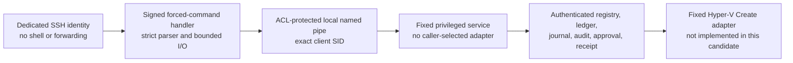

# NorthGate create-only production release candidate

## Current outcome

This directory is a **hard-disabled release candidate**, not an activated control plane.
It makes no host changes and exposes no working VM mutation. `status` describes the
missing gates; production `plan`, `apply`, and `receipt` requests reject explicitly.
The installer, approval writer, and rollback entry points are deliberately
non-operative until a separately reviewed release bakes in the required trust anchor.

Do not run repository checkout content on the Hyper-V host. Build an immutable package
on the workstation, sign and approve it through the release ceremony, and install only
the verified copy into a protected, versioned host directory.

## Security boundary



The SSH identity must remain unprivileged and must not be a member of Hyper-V
Administrators or local Administrators. The service, not the SSH process, owns the
single cross-process writer lock. The existing MCP forwarding identity and the legacy
generic MCP endpoint are outside this path and must not be reachable by this identity.

## Exact wire protocol

The forced command accepts only these case-sensitive ASCII forms:

| Command | Standard input | Candidate behavior |
|---|---|---|
| `status` | Empty | Returns disabled release status through the pipe service. |
| `plan` | Canonical UTF-8 JSON, maximum 32,768 bytes | Validates the request, then production rejects because the durable service registry is not promoted. |
| `apply ngp-<64 lowercase hex>` | Empty | Rejects: live apply is not implemented. |
| `receipt ngp-<64 lowercase hex>` | Empty | Rejects: asymmetric receipt signing is not implemented. |

`plan` accepts only `assetId`, `changeId`, and the exact repository identity, commit,
tree, signed release SHA-256, and host allowlist ID. It does not accept paths, switch
names, VLANs, ISO locations, storage roots, command names, PowerShell, or guest input.
The privileged boundary re-parses the full envelope rather than trusting the SSH parser.

## Fixed fleet policy

Every VM is Generation 2, dynamically allocated memory, dynamically expanding VHDX,
Secure Boot enabled, initially off, and destroy protected. Windows entries require a
vTPM. The service never exposes start, update, replace, delete, adopt, guest-command,
general host-command, switch-create, or VLAN-create operations.

| Asset | VM name | Class | CPU | Memory MiB min/start/max | Disk GiB | Opaque volume | VLAN profile / ID |
|---|---|---:|---:|---:|---:|---|---|
| NG-VM-018 | NG-DEB-CAN01 | canary | 2 | 2048/2048/4096 | 40 | volume-d | business-apps / 150 |
| NG-VM-010 | NG-CANARY-01 | canary | 2 | 4096/4096/8192 | 80 | volume-f | users-workstations / 110 |
| NG-VM-019 | NG-MAIL-EXT01 | persistent | 2 | 2048/2048/4096 | 40 | volume-d | external-mail / 240 |
| NG-VM-020 | NG-MAIL-INT01 | persistent | 2 | 2048/4096/8192 | 80 | volume-d | mail-internal / 120 |
| NG-VM-011 | NG-WRK-01 | persistent | 2 | 4096/4096/6144 | 80 | volume-f | users-workstations / 110 |
| NG-VM-012 | NG-WRK-02 | persistent | 2 | 4096/4096/6144 | 80 | volume-f | users-workstations / 110 |
| NG-VM-013 | NG-MGR-01 | persistent | 2 | 4096/4096/6144 | 80 | volume-f | users-workstations / 110 |
| NG-VM-014 | NG-IT-01 | persistent | 4 | 4096/8192/12288 | 100 | volume-f | it-admin-workstations / 130 |
| NG-VM-015 | NG-CYBER-01 | persistent | 4 | 4096/8192/12288 | 120 | volume-f | cyber-workstations / 140 |
| NG-VM-016 | NG-HR-APP01 | persistent | 2 | 2048/4096/8192 | 100 | volume-d | business-apps / 150 |
| NG-VM-017 | NG-PLAT-APP01 | persistent | 4 | 4096/8192/16384 | 120 | volume-d | commercial-dmz / 160 |
| NG-VM-021 | NG-KALI-EXT01 | persistent | 4 | 4096/4096/12288 | 100 | volume-d | sim-wan / 250 |

Persistent disk ceilings are 440 GiB on `volume-d` and 460 GiB on `volume-f`.
The Debian and Windows canaries use an additional 40 and 80 GiB respectively, and
must never overlap. Minimum post-plan free space is the greater of 100 GiB or 15%.

The only rollout order is:

1. Debian canary (`NG-VM-018`) alone.
2. Record independent acceptance and reconcile the durable state.
3. Windows canary (`NG-VM-010`) alone.
4. Record independent acceptance and reconcile the durable state.
5. Enable one persistent asset per fresh host-issued plan.

## Host deployment authorization

Host paths and identities are not Git defaults. A separate admin-controlled process
must create and sign a data-only authorization conforming to
`host-deployment-authorization.schema.json`. It binds the exact release manifest,
commit, tree, allowlist, protected install/state roots, SSH and service SIDs, independent
approval and receipt signer certificates, existing switch identity/fingerprint and VLAN
map, volume UniqueIds plus roots/ceilings, and exact image path/hash/size. The unattended
ISO is never an allowed image.

The release-signing key, approval key, receipt key, SSH private key, state-protection
keys, and credentials must never be stored in Git, package files, command parameters,
environment variables, or chat.

## Package and install state

`New-NorthGateCreateOnlyReleasePackage.ps1` copies a fixed allowlist through
non-shareable source handles into a new directory outside any repository and emits a
hash manifest. The output is intentionally unsigned and reports `installable=false`.

`Install-NorthGateCreateOnlyRelease.ps1` requires explicit release-manifest, commit,
tree, allowlist, and signed-deployment-authorization pins. It then hard-fails with
`NGCOR-INSTALL-BLOCKED-TRUST-ANCHOR-NOT-BAKED` before any write because this candidate
does not contain the independent release trust anchor. Do not replace that failure with
a parameter or environment setting.

## Required work before promotion

- Complete the transactional installer and exact code/config-only rollback with
  non-shareable handle verification, protected ACL readback, signed service setup,
  SSH backup/readback, negative self-tests, and disabled initial policy.
- Implement the privileged fixed collector and Hyper-V adapter without runtime
  delegates or command lookup. Revalidate collisions, capacity, reparse state, media,
  switch, VLAN, reservations, and observed-state hash while holding the engine lock.
- Implement separately signed, one-time approval consumption and independently signed
  receipts. Pin release, approval, and receipt signers independently.
- Add rollback-detecting external state anchors, sequenced/hash-chained fail-closed
  audit, `Prepared`/`Applying` crash recovery, and `OutcomeUnknown` reconciliation.
- Create only by returned VM ID plus transaction markers. On uncertainty, block reuse
  and disconnect a proven transaction-owned VM; never delete by name or caller path.
- Prove the routine identity cannot reach the legacy MCP mutators, PowerShell remoting,
  forwarding, SFTP/SCP, a shell, Hyper-V cmdlets, or writable release/state ancestors.

Run focused simulation and negative tests on the workstation:

```powershell
powershell.exe -NoProfile -ExecutionPolicy Bypass -File .\Test-CreateOnlyRelease.ps1
```
