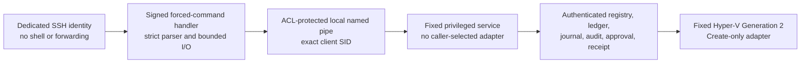

# NorthGate create-only production release candidate

## Current outcome

This directory contains the source implementation of the guarded create-only control
plane. The installed service routes `status`, `plan`, approval registration, `apply`,
and `receipt` to the transaction-owned Generation 2 Hyper-V backend. It exposes no
update, replace, adopt, power, delete, guest-command, or general host-command path.

Source readiness is not host activation. The checked-in installer and rollback scripts
contain blank public-certificate pins and fail before mutation. A reviewed one-time
bootstrap copy must bake the exact release and deployment-authorization certificate
SHA-256 pins, and a separately signed backend policy must explicitly authorize only
`Create`. No live installation is performed by the tests in this directory.

Do not run repository checkout content on the Hyper-V host. Build an immutable package
on the workstation, sign and approve it through the release ceremony, and install only
the verified copy into a protected, versioned host directory.

## Security boundary



The SSH identity must remain unprivileged and must not be a member of Hyper-V
Administrators or local Administrators. The service, not the SSH process, owns the
single cross-process writer lock. The existing MCP forwarding identity and the legacy
generic MCP endpoint are outside this path and must not be reachable by this identity.

## Exact wire protocol

The forced command accepts only these case-sensitive ASCII forms:

| Command | Standard input | Candidate behavior |
|---|---|---|
| `status` | Empty | Returns signed backend-policy and transaction state. |
| `plan` | Canonical UTF-8 JSON, maximum 32,768 bytes | Produces one fresh, expiring, authenticated one-asset Create plan. |
| `apply ngp-<64 lowercase hex>` | Empty | Consumes one exact registered approval and runs the create-only transaction. |
| `receipt ngp-<64 lowercase hex>` | Empty | Returns the detached-CMS-signed receipt. |

Two additional named-pipe operations are available only to a native elevated local
administrator, not the routine SSH identity: `approval-context ngp-<64 lowercase hex>`
returns the exact authenticated plan evidence, and `approve ngp-<64 lowercase hex>`
registers canonical approval bytes plus a detached CMS signature. The service binds
the embedded approving SID to the impersonated pipe client. The approval certificate
is a distinct, non-exportable CurrentUser key; approval IDs and nonces are single-use.

`plan` accepts only `assetId`, `changeId`, and the exact repository identity, commit,
tree, signed release SHA-256, and host allowlist ID. It does not accept paths, switch
names, VLANs, ISO locations, storage roots, command names, PowerShell, or guest input.
The privileged boundary re-parses the full envelope rather than trusting the SSH parser.

## Fixed fleet policy

Every VM is Generation 2, uses the fixed memory and dynamically expanding VHDX policy,
is destroy protected, and boots from exactly one asset-bound derivative ISO. Secure
Boot and vTPM settings are fixed per firmware profile, including the explicit Kali
Secure Boot exception. An approved `Create` may start only the transaction-owned new
VM after its configuration readback; there is no standalone start, stop, update,
replace, delete, adopt, guest-command, general host-command, switch-create, or
VLAN-create operation. Any uncertain result is forced off, disconnected, and
quarantined.

| Asset | VM name | Class | CPU | Memory MiB min/start/max | Disk GiB | Opaque volume | VLAN profile / ID |
|---|---|---:|---:|---:|---:|---|---|
| NG-VM-018 | NG-DEB-CAN01 | canary | 2 | 2048/2048/4096 | 40 | volume-d | business-apps / 150 |
| NG-VM-010 | NG-CANARY-01 | canary | 2 | 4096/4096/8192 | 80 | volume-f | users-workstations / 110 |
| NG-VM-014 | NG-MAIL-EXT01 | persistent | 2 | 2048/2048/4096 | 40 | volume-d | external-mail / 240 |
| NG-VM-013 | NG-MAIL-INT01 | persistent | 2 | 2048/4096/8192 | 80 | volume-d | mail-internal / 120 |
| NG-VM-011 | NG-WRK-01 | persistent | 2 | 4096/4096/6144 | 80 | volume-f | users-workstations / 110 |
| NG-VM-012 | NG-WRK-02 | persistent | 2 | 4096/4096/6144 | 80 | volume-f | users-workstations / 110 |
| NG-VM-019 | NG-MGR-01 | persistent | 2 | 4096/4096/6144 | 80 | volume-f | users-workstations / 110 |
| NG-VM-020 | NG-IT-01 | persistent | 4 | 4096/8192/12288 | 100 | volume-f | it-admin-workstations / 130 |
| NG-VM-021 | NG-CYBER-01 | persistent | 4 | 4096/8192/12288 | 120 | volume-f | cyber-workstations / 140 |
| NG-VM-016 | NG-HR-APP01 | persistent | 2 | 2048/4096/8192 | 100 | volume-d | business-apps / 150 |
| NG-VM-017 | NG-PLAT-APP01 | persistent | 4 | 4096/8192/16384 | 120 | volume-d | commercial-dmz / 160 |
| NG-VM-015 | NG-KALI-EXT01 | persistent | 4 | 4096/4096/12288 | 100 | volume-d | sim-wan / 250 |

Persistent disk ceilings are 440 GiB on `volume-d` and 460 GiB on `volume-f`.
The Debian and Windows canaries use an additional 40 and 80 GiB respectively, and
must never overlap. Minimum post-plan free space is the greater of 100 GiB or 15%.

The only rollout order is:

1. Debian canary (`NG-VM-018`) alone.
2. Record independent acceptance and reconcile the durable state.
3. Windows canary (`NG-VM-010`) alone.
4. Record independent acceptance and reconcile the durable state.
5. Enable one persistent asset per fresh host-issued plan.

The immutable signed backend policy carries the initial Debian-only stage and exact
asset order. Advancing to the Windows canary or persistent fleet uses a same-release,
approval-signer-authorized promotion containing the prior canary's verified receipt,
independent acceptance and retirement evidence hashes, plus live readback that the
canary is absent or off and disconnected. Immutable HMAC/CMS promotion history remains
under the existing backend state root; an atomic HMAC `rollout/current.json` anchor
records the monotonic sequence without changing the base policy or moving its ledger
and receipts. At most one nonterminal transaction may exist, and persistent assets are
admitted only in the serialized order above.

## Host deployment authorization

Host paths and identities are not Git defaults. A separate admin-controlled process
must create and sign a data-only authorization conforming to
`host-deployment-authorization.schema.json`. Version 2 binds the exact release manifest,
commit, tree, allowlist, governance decision, target host, protected install/state roots,
distinct SSH/service identities, four distinct signer roles, existing switch and trunk
adapter identities, the exact eight-profile VLAN map, both unique volumes, all three
immutable images, and the five retained VMs plus their disk and adapter identities. The
authorization expires within 24 hours, begins with apply disabled, and records that the
routine SSH identity has no local-administrator, Hyper-V-administrator, remoting, or
legacy-MCP path. Each asset-specific full derivative ISO and provenance sidecar must be
explicitly bound to one authorized source image by the signed authorization and policy.
Only the derivative ISO is attached, as the VM's single DVD; neither its path nor a
source-image path is accepted from a VM manifest or caller.

The `hyperVHostId` binding is the normalized lowercase SMBIOS UUID returned by
`Win32_ComputerSystemProduct.UUID`. Windows Server 2022 `Get-VMHost` does not expose an
`Id` property, and the hosting `Msvm_ComputerSystem.Name` is only the computer name;
neither is accepted as the stable host GUID.

VM network-adapter bindings use the bare GUID returned by
`VMNetworkAdapter.AdapterId`. The `Id` property is a composite provider resource path
(`Microsoft:<VM GUID>\<adapter GUID>`) and is never accepted where the authorization
schema requires an adapter GUID.

`Test-NorthGateCreateOnlyHostAuthorization.ps1` performs strict canonical-JSON and
semantic validation against the pinned package tuple. Its result explicitly says that
the detached signature has **not** been verified and remains `installable=false`. The
reviewed bootstrap generator bakes only the exact public signer pins into one-time
installer and rollback copies; that installer independently verifies every required
detached CMS signature before importing package code or writing host state.

The release-signing key, approval key, receipt key, SSH private key, state-protection
keys, and credentials must never be stored in Git, package files, command parameters,
environment variables, or chat.

## Package and install state

`New-NorthGateCreateOnlyReleasePackage.ps1` accepts only the canonical GitHub repository
identity at the exact release subtree, requires `HEAD` and the supplied commit/tree to
agree, rejects a dirty worktree, replacement refs, submodules, special tree entries and
content filters, then writes the fixed runtime allowlist from raw Git blob object IDs.
The native service executable is the sole derived artifact: the builder reproduces it
with an exact-hash Roslyn compiler and framework references, requires byte-identical
output, and records its detached CMS signature and complete provenance. The canonical
version-2 manifest binds both artifact kinds. The manifest is signed separately.

`Install-NorthGateCreateOnlyRelease.ps1` requires explicit release-manifest, commit,
tree, allowlist, signed host authorization, signed backend policy, and signed data-bundle
hashes. Exact pinned detached CMS verification occurs before packaged code is imported;
it requires one time-valid, non-CA Code Signing leaf with DigitalSignature usage and
does not mutate or rely on the Windows trust stores. The transaction stages immutable
runtime data under the versioned release, creates a service-writable backend-state child
without granting write access to deployment journals, backs up managed configuration,
activates the native service and confined SSH path, verifies readback, and quarantines
ambiguous output on recovery.

`New-NorthGateCreateOnlyBootstrap.ps1` produces review-required installer and rollback
copies outside Git with only the two approved public certificate pins substituted. The
outputs remain non-installable until their hashes are natively reviewed, approved,
transferred over pinned SSH, and read back on the host.

Rollout promotion is native-Administrator-only. The service operations
`rollout-context` and `promote-rollout` are unavailable to the routine SSH identity,
service identity, SYSTEM, and non-administrators. The installed-only helper
`New-NorthGateCreateOnlyRolloutPromotion.ps1` obtains the authenticated context, hashes
the independent acceptance and retirement evidence, creates the canonical expiring
promotion, signs it with the exact approval-signer certificate, and submits it directly
through the pinned local named pipe. It never replaces `backend-policy.json`.

## Remaining promotion gates

- Merge the reviewed source and build from the exact clean commit/tree.
- Author and sign the host authorization, backend policy, fleet data bundle, derivative
  media bindings, release manifest, and one-time bootstrap hashes with distinct pins.
- Run the full Windows PowerShell 5.1 negative suite and private CI on that exact tuple.
- Capture host backup/readiness evidence and conduct a disabled-install rollback drill.
- Promote the Debian canary first, require independent acceptance, then the Windows
  canary, and issue a fresh exact approval for each later asset in the approved order.

Run focused simulation and negative tests on the workstation:

```powershell
powershell.exe -NoProfile -ExecutionPolicy Bypass -File .\Test-CreateOnlyRelease.ps1
```
