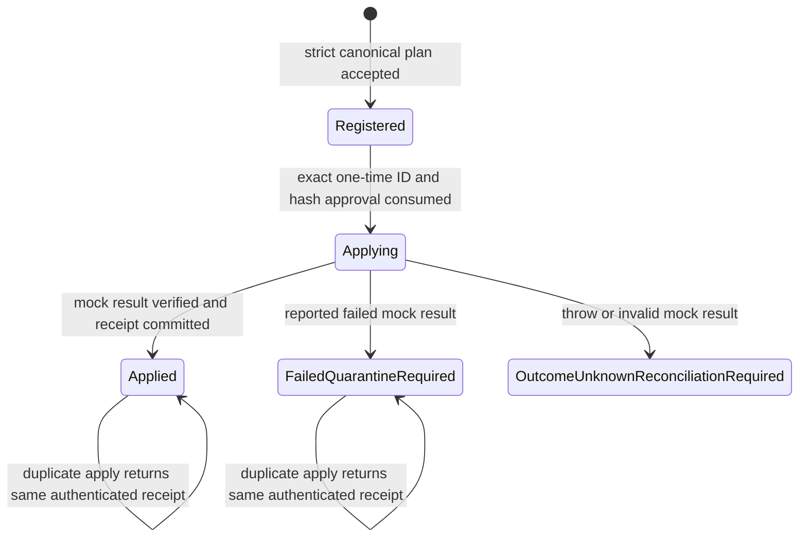

# VM Factory production-intent engine scaffold

This directory models the production authorization and state machine without exposing or invoking a live virtualization adapter. It is an undeployed, simulation-only scaffold. The repository resource policy stays disabled, this source is not an installed release, and it must never be executed from a checkout on the Hyper-V host.

## Routine interface

The module exports only four routine operations:

| MCP binding | Engine function | Application payload |
| --- | --- | --- |
| `vm_factory_get_state` | `Get-NorthGateVmFactoryEngineState` | none |
| `vm_factory_register_plan` | `Register-NorthGateVmFactoryEnginePlan` | canonical plan JSON |
| `vm_factory_get_plan` | `Get-NorthGateVmFactoryEnginePlan` | `planId` |
| `vm_factory_apply_plan` | `Invoke-NorthGateVmFactoryEngineApply` | `planId` only |

The context and authentication envelope shown in the PowerShell signatures are server composition and middleware inputs, not MCP application payload fields. No command, script, path, switch, arbitrary operation, or direct lifecycle function is exported.

## Enforced state machine

Registration issues a cryptographically random plan ID on the engine side. The returned plan hash is HMAC-SHA-256 over the plan ID, host expiry, and canonical plan. Registry, ledger, and receipt records are independently authenticated with domain-separated HMACs. The key is injected at runtime, requires at least 256 bits, is never serialized, and has no repository default.

Apply authenticates the application, takes only `planId`, requires an independently verified protected state root, obtains the host-wide exclusive writer lock, verifies the authenticated registry record and expiry, revalidates the identity reservation, and asks an external approval provider for a one-time approval matching the exact host-issued ID and hash. It rechecks expiry after approval before consuming it. Only then can it call the fixed internal mock. The engine context has no provisioner-delegate input. This scaffold requires `simulationEnabled=true`, `deployed=false`, and `liveApplyEnabled=false`.

## Strict plan contract

The built-in dependency-free parser rejects oversized JSON, control characters, duplicate or case-colliding properties, nulls, fractional/exponent numbers, excessive depth, unknown fields, and non-canonical serialization. The plan uses a fixed repository identity, exact commit and tree IDs, a current UTC timestamp, fixed hash fields, contiguous operations, opaque identity reservations, and only `Create` or `NoOp` simulation actions. It carries no path, URL, switch name, command, script, credential, or free-form bootstrap content.

Protected-branch reachability is verified by a provider that must return the exact repository identity, commit, and tree tuple it checked; a generic boolean is insufficient. That result must also match the tuple bound into the plan. A GitHub verified merge signature is not branch protection. The currently observed unprotected `main` branch therefore blocks real registration and apply; tests exercise the positive state only as an explicit local simulation fixture.

## Ledger, audit, receipt, and recovery state

- The authenticated identity ledger binds each asset ID, canonical VM name, and opaque reservation before registration. Only a successful plan apply can bind the returned mock VM ID.
- Every security-relevant transition emits a fixed-field, canonical, HMAC-authenticated audit event. Raw authentication input, canonical plans, exception text, and principal names are never written. Audit preflight failure stops before approval or adapter invocation.
- One fixed system-wide named semaphore covers registration, approval consumption, apply, ledger mutation, receipt creation, and plan-state updates even when independently constructed contexts use different state roots.
- A receipt ID is deterministic for its authenticated plan capability. The authenticated receipt binds executor and approval hashes, repository identity and exact commit/tree, policy/catalog hashes, installed component versions, before/after state, and signer identity. It is written before final plan-state readback; repeated apply returns that same receipt without consuming another approval or invoking the adapter again.
- A reported failed create produces `FailedQuarantineRequired`. A thrown or structurally invalid result produces `OutcomeUnknownReconciliationRequired`, a synthetic non-authoritative after-state hash, `afterStateVerified: false`, and an `OutcomeUnknown` ledger reservation that cannot be reused. Both paths require quarantine; existing-VM rollback is intentionally not implemented or exposed.

## Remaining promotion work

This scaffold is not production-ready. A separately reviewed privileged release must replace the internal mock with a fixed signed adapter selected at build time, never through a request or runtime scriptblock; bind application authentication to the MCP transport; use an OS-protected non-exportable MAC or signing key; prove restrictive ACLs and durable audit semantics; validate installed policy and normalized live state again under the same lock; handle crash recovery for an `Applying` journal; disable all routine direct mutators; and pass the full acceptance suite. It must be packaged and hash-pinned outside the deployment checkout.

Promotion remains blocked until protected-branch reachability is enforceable or a separately approved signed-promotion exception is designed and recorded. That exception cannot be inferred from a merge signature or from this scaffold.

## Validate

`Test-Engine.ps1` uses temporary state roots, runtime-only random MAC keys, injected authentication/repository-verification/approval providers, and the fixed internal mock. It covers strict JSON rejection, exact authentication types, tuple-bound protected-branch gating, identity mismatches, registry and receipt tamper detection, expiry before and after approval, exact one-time approval, lock contention, audit failure, successful idempotency, and quarantine-required failure behavior. It cleans up only its uniquely named temporary test root.
