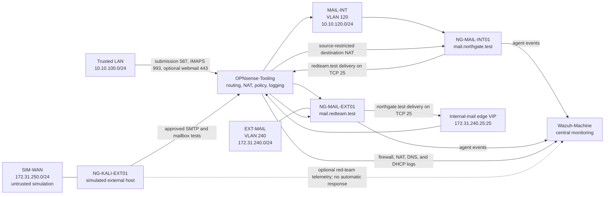

# ADR-0002: Segmented mail lab and simulated external adversary network

- **Status:** Proposed; plan-only; network realization amended by ADR-0003
- **Date:** 2026-08-01
- **Scope:** Distinct internal and simulated-external SMTP services, Kali testing, OPNsense routing, and Wazuh visibility

## Context

> **Amendment:** [ADR-0003](ADR-0003-segmented-windows-workstation-fleet.md) replaces this ADR's proposed one-private-switch-per-segment realization with one Hyper-V Private switch, an unnumbered OPNsense 802.1Q trunk, and access VLANs. It also adds VLAN 240 so the simulated-external SMTP service is isolated from Kali instead of sharing its hostile Layer 2 segment.

NorthGate needs separate internal and simulated-external SMTP services plus a Kali system that behaves like an external host while all three remain on the same Hyper-V server. A single mail server cannot accurately exercise both sides of SMTP delivery. Placing the services or Kali on the trusted LAN would weaken the exercise boundary, make firewall telemetry less useful, and create unnecessary access from an offensive workstation to retained infrastructure.

The VM Factory is still plan-only: apply is disabled, no image is promoted, and routine VM provisioning may neither create virtual switches nor rebind OPNsense adapters. Therefore this decision records intended topology and opaque catalog references without authorizing a host or VM change.

## Decision

Create three isolated zones in a later, separately approved control-plane change. OPNsense is the only router between them and the trusted network:

The proposed VM roles are:

| VM | Proposed role | Network profile | Initial platform target |
| --- | --- | --- | --- |
| `NG-MAIL-INT01` | Internal mailbox, authenticated submission, and delivery for `northgate.test` | `mail-dmz` | Generation 2 Debian; 2 vCPU; dynamic 2/4/8 GiB; 80 GiB; Postfix, Dovecot, Rspamd, Redis, ClamAV, and Wazuh agent |
| `NG-MAIL-EXT01` | Isolated external mailbox and SMTP transfer service for `redteam.test` | `ext-mail` | Generation 2 Debian; 2 vCPU; dynamic 2/2/4 GiB; 40 GiB; Postfix, Dovecot, bounded antispam controls, and Wazuh agent |
| `NG-KALI-EXT01` | Operator-controlled adversary simulation and external-mail test client | `sim-wan` | Generation 2 Kali; 4 vCPU; dynamic 4/4/12 GiB; 100 GiB from a later promoted immutable image |

The services use reserved test-only names: `northgate.test` for internal recipients, `redteam.test` for simulated-external recipients, `mail.northgate.test` for the internal server, `mail.redteam.test` for the external server, and `mx-inbound.northgate.test` for the source-restricted internal edge. Split-horizon test DNS supplies the matching MX records. Neither service advertises public DNS, uses a real organization's domain, or accepts unsolicited traffic from the physical WAN.

The complete build, SMTP-flow, validation, rollback, and recovery contract is in the [mail lab deployment plan](../mail-lab-deployment-plan.md). Proposed names, addresses, and resource values are planning candidates rather than protected-ledger reservations.

Sensor roles, Wazuh group boundaries, collection sources, detection promotion, rollback, and evidence gates are governed by the [Wazuh sensor and detection-engineering standard](../wazuh-sensor-and-detection-standard.md). That standard is also proposed and does not authorize installation or rule deployment.

## Security policy intent

- Treat `sim-wan` as hostile. Deny and log access from it to the trusted LAN, management interfaces, OPNsense administration, MAIL-INT, and every EXT-MAIL service except the exact SMTP and mailbox ports approved for `NG-MAIL-EXT01`. An optional Kali Wazuh agent requires a separately approved exact-source exception to agent transport only; management surfaces remain denied.
- Permit only `NG-MAIL-EXT01` to reach `172.31.240.25` on TCP 25. Translate only that source and destination to `NG-MAIL-INT01` on TCP 25. Kali has no direct path to that VIP or to MAIL-INT.
- Permit only `NG-MAIL-INT01` to reach `NG-MAIL-EXT01` on TCP 25 for `redteam.test` delivery. Permit Kali to reach the external server only on the approved SMTP submission, SMTP-test, and mailbox-test ports; all access crosses OPNsense.
- Do not use NAT reflection, a physical-WAN port forward, bridge mode, or a default route that bypasses OPNsense.
- Permit trusted clients to use authenticated internal submission on TCP 587 with STARTTLS and IMAPS on TCP 993. If webmail is later added, restrict TCP 443 to trusted client zones and administer it only from IT-ADMIN.
- Reject unauthenticated relaying on both servers, require valid local or explicitly relayed test domains and recipients, and use synthetic lab accounts rather than Active Directory credentials in the first phase. Relay tests must prove arbitrary third-party destinations are rejected.
- Use a private lab CA or pinned test certificates for SMTP and IMAP TLS. Distribute only the CA certificate; keep private keys and account credentials out of Git, TacticalRMM arguments/environment, chat, and evidence notes.
- Permit controlled package updates over TCP 80/443. Block direct outbound TCP 25 to the physical WAN from MAIL-INT, EXT-MAIL, and SIM-WAN.
- Send mail, authentication, antispam, malware-scan, firewall, NAT, DNS, and routing telemetry to Wazuh under the [sensor standard](../wazuh-sensor-and-detection-standard.md). Place any Kali agent in a dedicated red-team group with automatic response disabled.

## Provisioning and promotion gates

1. Record and approve the IP assignments in Operation-SeeSaw using the companion [IPAM plan](../ipam-plan.md).
2. Back up OPNsense and capture current Hyper-V switch and adapter inventory.
3. Through the ADR-0003 control-plane change, create the shared private trunk and VLANs 120, 240, and 250, configure the OPNsense interfaces, and install default-deny rules. Routine VM apply cannot perform these actions.
4. Retain the proposed `mail-dmz` opaque profile for the internal server and separately propose `ext-mail`; install authoritative host-policy mappings for `ng-network-mail-dmz-v1`, `ng-network-ext-mail-v1`, and `ng-network-sim-wan-v1`, including immutable switch identity or fingerprint checks. Catalog promotion is a separate change.
5. Verify isolation with negative tests before any workload is attached: SIM-WAN cannot reach the trusted LAN, OPNsense administration, MAIL-INT, the internal edge VIP, or the physical-WAN SMTP path.
6. Promote immutable Debian and Kali images, secret-safe mail bootstrap profiles, and complete the VM Factory Phase 0 and disposable-canary gates.
7. Promote the network catalog separately from the first VM change that consumes it.
8. Only then author VM manifests with approved ownership, classification, recovery, bootstrap, firmware, storage, and lifecycle metadata.
9. Approve the role-specific sensor mapping and its separate canary, rollback, and evidence plan; do not enable Active Response for either initial mail service or Kali.
10. Deploy and accept the external SMTP server, then the internal SMTP server, then the Kali client according to the mail deployment plan. Stop on any open-relay, cross-zone, DNS, TLS, queue, telemetry, or identity failure.
11. Generate a fresh post-merge plan for each bounded VM change, obtain the host-issued plan ID and authenticated hash, receive separate deployment approval, apply through the guarded MCP path, and validate the signed receipt.

## Consequences

### Positive

- Produces a credible two-server external-to-internal SMTP path while keeping the exercise contained on one physical host.
- Forces simulated attack traffic through OPNsense, improving Wazuh network evidence and rule-development value.
- Keeps offensive tooling away from retained trusted systems by default.
- Supports repeatable internal and external mail tests without exposing a public SMTP service.

### Costs and residual risk

- OPNsense becomes a dependency for all three lab zones and needs additional VLAN interfaces, firewall policy, backup, and recovery testing.
- A single physical Hyper-V host is not a physical security boundary; a host compromise can cross every virtual segment.
- Mail reputation, public DNS, DKIM alignment, and real Internet delivery are explicitly out of scope for this phase.
- Proposed catalog entries are non-operative until host mappings, validation, approvals, images, and factory apply gates are complete.

## Rejected alternatives

- Put Kali and mail directly on the trusted LAN.
- Connect Kali directly to the physical external switch.
- Publish SMTP from the physical WAN for testing.
- Allow routine VM provisioning to create switches, add OPNsense interfaces, or change firewall rules.
- Create VM manifests before immutable images and required governance metadata are approved.
