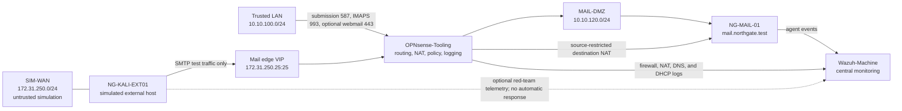

# ADR-0002: Segmented mail lab and simulated external adversary network

- **Status:** Proposed; plan-only
- **Date:** 2026-08-01
- **Scope:** NorthGate lab mail, simulated external testing, OPNsense routing, and Wazuh visibility

## Context

NorthGate needs an internal mail service and a Kali system that behaves like an external host while remaining on the same Hyper-V server. Placing both systems on the trusted LAN would weaken the exercise boundary, make firewall telemetry less useful, and create unnecessary access from an offensive workstation to retained infrastructure.

The VM Factory is still plan-only: apply is disabled, no image is promoted, and routine VM provisioning may neither create virtual switches nor rebind OPNsense adapters. Therefore this decision records intended topology and opaque catalog references without authorizing a host or VM change.

## Decision

Create two isolated Layer 2 segments in a later, separately approved control-plane change. OPNsense is the only router between them and the trusted network:

The proposed VM roles are:

| VM | Proposed role | Network profile | Initial platform target |
| --- | --- | --- | --- |
| `NG-MAIL-01` | Internal mail submission and delivery plus a controlled SMTP target for simulations | `mail-dmz` | Generation 2 Debian stable; Postfix, Dovecot, Rspamd, Redis, ClamAV, and Wazuh agent |
| `NG-KALI-EXT01` | Operator-controlled adversary simulation and external-mail test source | `sim-wan` | Generation 2 Kali Linux from a later promoted immutable image |

The mail service uses reserved test-only names: `northgate.test` for recipients, `redteam.test` for adversary identities, `mail.northgate.test` for the server, and `mx-edge.northgate.test` for the simulated edge. It does not advertise public DNS or accept unsolicited traffic from the physical WAN.

Sensor roles, Wazuh group boundaries, collection sources, detection promotion, rollback, and evidence gates are governed by the [Wazuh sensor and detection-engineering standard](../wazuh-sensor-and-detection-standard.md). That standard is also proposed and does not authorize installation or rule deployment.

## Security policy intent

- Treat `sim-wan` as hostile. Deny and log access from it to the trusted LAN, management interfaces, OPNsense administration, and every DMZ service except the simulated SMTP edge. An optional Kali Wazuh agent requires a separately approved exact-source exception to agent transport only; management surfaces remain denied.
- Permit `NG-KALI-EXT01` to reach `172.31.250.25` on TCP 25. Translate only that source and destination to `NG-MAIL-01` on TCP 25.
- Do not use NAT reflection, a physical-WAN port forward, bridge mode, or a default route that bypasses OPNsense.
- Permit trusted clients to use authenticated submission on TCP 587 with STARTTLS and IMAPS on TCP 993. If webmail is later added, restrict TCP 443 to trusted management sources.
- Reject unauthenticated relaying, require valid local recipients, and use synthetic lab accounts rather than Active Directory credentials in the first phase.
- Permit controlled package updates over TCP 80/443. Block direct outbound TCP 25 to the physical WAN from both new segments.
- Send mail, authentication, antispam, malware-scan, firewall, NAT, DNS, and routing telemetry to Wazuh under the [sensor standard](../wazuh-sensor-and-detection-standard.md). Place any Kali agent in a dedicated red-team group with automatic response disabled.

## Provisioning and promotion gates

1. Record and approve the IP assignments in Operation-SeeSaw using the companion [IPAM plan](../ipam-plan.md).
2. Back up OPNsense and capture current Hyper-V switch and adapter inventory.
3. Through a separate control-plane change, create the two private switches, attach one new OPNsense interface to each, configure interface addresses, and install default-deny rules. Routine VM apply cannot perform these actions.
4. Install authoritative host-policy mappings for `ng-network-mail-dmz-v1` and `ng-network-sim-wan-v1`, including immutable switch identity or fingerprint checks.
5. Verify isolation with negative tests before any workload is attached: SIM-WAN cannot reach the trusted LAN, OPNsense administration, or the physical WAN SMTP path.
6. Promote immutable Debian and Kali images and complete the VM Factory Phase 0 and disposable-canary gates.
7. Promote the network catalog separately from the first VM change that consumes it.
8. Only then author VM manifests with approved ownership, classification, recovery, bootstrap, firmware, storage, and lifecycle metadata.
9. Approve the role-specific sensor mapping and its separate canary, rollback, and evidence plan; do not enable Active Response for the initial mail or Kali deployment.
10. Generate a fresh post-merge plan, obtain the host-issued plan ID and authenticated hash, receive separate deployment approval, apply through the guarded MCP path, and validate the signed receipt.

## Consequences

### Positive

- Produces a credible external-to-DMZ path while keeping the exercise contained on one physical host.
- Forces simulated attack traffic through OPNsense, improving Wazuh network evidence and rule-development value.
- Keeps offensive tooling away from retained trusted systems by default.
- Supports repeatable internal and external mail tests without exposing a public SMTP service.

### Costs and residual risk

- OPNsense becomes a dependency for both lab segments and needs additional interfaces, firewall policy, backup, and recovery testing.
- A single physical Hyper-V host is not a physical security boundary; a host compromise can cross every virtual segment.
- Mail reputation, public DNS, DKIM alignment, and real Internet delivery are explicitly out of scope for this phase.
- Proposed catalog entries are non-operative until host mappings, validation, approvals, images, and factory apply gates are complete.

## Rejected alternatives

- Put Kali and mail directly on the trusted LAN.
- Connect Kali directly to the physical external switch.
- Publish SMTP from the physical WAN for testing.
- Allow routine VM provisioning to create switches, add OPNsense interfaces, or change firewall rules.
- Create VM manifests before immutable images and required governance metadata are approved.
