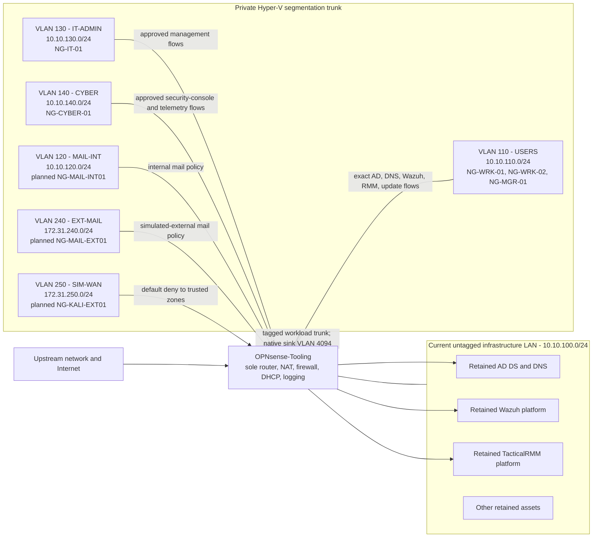

# ADR-0003: Segmented Windows workstation fleet

- **Status:** Proposed; plan-only
- **Date:** 2026-08-01
- **Scope:** Five Windows 11 workstations, internal and external mail zones, Hyper-V VLAN fabric, domain services, TacticalRMM, Wazuh, and endpoint security

## Context

NorthGate needs five purpose-separated Windows workstations: two ordinary workers, one manager, one IT administration workstation, and one cyber-defense workstation. The retained environment uses an untagged `10.10.100.0/24` trusted infrastructure LAN with OPNsense routing, Active Directory/DNS, Wazuh, and TacticalRMM dependencies. Exact retained asset addresses and live dependency evidence remain in Operation-SeeSaw.

Putting all five endpoints directly on that infrastructure LAN would give ordinary user systems unnecessary Layer 2 proximity to critical management services. Giving the IT and cyber roles the same policy as ordinary users would also blur privileged administration, blue-team operations, and normal user activity.

The VM Factory remains intentionally plan-only. Apply is disabled, no Windows image is promoted, no Windows bootstrap profile exists, required catalog profiles are not approved, and the current MCP VM-creation operation does not expose a vTPM control. This decision therefore defines reviewed intent without authorizing a VM, switch, VLAN, OPNsense, Active Directory, TacticalRMM, or Wazuh change.

## Decision

Propose `NG-VM-010` for the mandatory disposable factory canary and `NG-VM-011` through `NG-VM-015` for the workstation fleet. These are planning candidates, not protected-ledger reservations; final allocation requires a fresh ledger and live-state collision check.

| Candidate asset ID | Proposed VM and Windows name | Role baseline | Planning resources | Proposed fixed address |
| --- | --- | --- | --- | --- |
| `NG-VM-011` | `NG-WRK-01` | Worker canary, then ordinary user endpoint | 2 vCPU; dynamic 4/4/8 GiB; 80 GiB OS disk | `10.10.110.20` |
| `NG-VM-012` | `NG-WRK-02` | Ordinary user endpoint | 2 vCPU; dynamic 4/4/8 GiB; 80 GiB OS disk | `10.10.110.21` |
| `NG-VM-013` | `NG-MGR-01` | Manager endpoint | 2 vCPU; dynamic 4/4/8 GiB; 80 GiB OS disk | `10.10.110.22` |
| `NG-VM-014` | `NG-IT-01` | Privileged IT administration workstation | 4 vCPU; dynamic 4/8/16 GiB; 100 GiB OS disk | `10.10.130.20` |
| `NG-VM-015` | `NG-CYBER-01` | Blue-team analysis and detection-engineering workstation | 4 vCPU; dynamic 4/8/16 GiB; 120 GiB OS disk | `10.10.140.20` |

The target names, resources, addresses, owner, storage, recovery, firmware, network, and bootstrap choices remain proposed until their separate approvals. Manifests are authored only after the protected ledger and every opaque catalog reference are approved.

The target build is Windows 11 Pro, Generation 2, Microsoft Windows Secure Boot, and vTPM 2.0 because domain join and supported Windows 11 security are required. Operation-SeeSaw readiness evidence records one authentic multi-edition Microsoft Windows 11 media candidate and one credential-bearing unattended derivative that is rejected and quarantine-required. Promotion still requires an approved-root artifact, exact digest, Windows 11 Pro selection, and licensing path. No credential value belongs in this repository or the evidence record.

## Target network architecture

Keep the retained infrastructure LAN untagged during the migration. Add one Hyper-V switch of type **Private**, not Internal, as the segmentation fabric. Attach one new OPNsense adapter to it in 802.1Q trunk mode and attach each workload adapter in access mode for exactly one VLAN. OPNsense remains the only Layer 3 path. The management operating system has no adapter on the private switch.

This shared trunk supersedes the proposed one-private-switch-per-segment realization in ADR-0002 and adds a dedicated EXT-MAIL VLAN so Kali and the external SMTP server do not share Layer 2. ADR-0002's source-restricted SMTP simulation and default-deny boundary otherwise remain controlling. Because nothing from ADR-0002 has been deployed, no live migration is implied.

## VLAN and zone plan

| VLAN | Zone | Subnet and gateway | Initial workloads | Default policy |
| --- | --- | --- | --- | --- |
| Untagged | `INFRA` | `10.10.100.0/24`, gateway `10.10.100.1` | Retained host, DC/DNS, Wazuh, TacticalRMM, retained VMs | Preserve current service while rules are narrowed and verified |
| 110 | `USERS` | `10.10.110.0/24`, gateway `10.10.110.1` | Two workers and manager | Deny to management; allow exact domain, monitoring, patch, mail, and Internet flows |
| 120 | `MAIL-INT` | `10.10.120.0/24`, gateway `10.10.120.1` | Planned internal SMTP and mailbox server | ADR-0002 internal-mail policy |
| 130 | `IT-ADMIN` | `10.10.130.0/24`, gateway `10.10.130.1` | IT workstation | Deny by default; allow reviewed administration to exact managed assets and services |
| 140 | `CYBER` | `10.10.140.0/24`, gateway `10.10.140.1` | Cyber workstation | Deny by default; allow approved Wazuh, log, case, update, and bounded investigation flows |
| 240 | `EXT-MAIL` | `172.31.240.0/24`, gateway `172.31.240.1` | Planned simulated-external SMTP and mailbox server | Treat as untrusted service; exact SMTP, monitoring, update, and IT-admin exceptions only |
| 250 | `SIM-WAN` | `172.31.250.0/24`, gateway `172.31.250.1` | Planned external Kali VM | Treat as hostile; ADR-0002 default-deny policy |
| 4094 | `NATIVE-SINK` | No subnet, gateway, interface, DHCP, DNS, or route | None | Hyper-V-required native VLAN ID; discard and log any untagged-frame test |

Do not assign VLAN 100 to the current LAN during the first implementation. A later physical-fabric project may tag that network as VLAN 100 only after switch-port inventory, OPNsense backup, out-of-band recovery, and a tested migration plan exist.

## Access policy intent

- `USERS` may reach `JS-DC-01` only for the exact Active Directory, Kerberos, DNS, time, Group Policy, and certificate flows proven necessary. It may reach Wazuh agent transport and verified TacticalRMM agent endpoints, but not their dashboards, APIs, SSH, database, or management listeners.
- `USERS` has no direct access to Hyper-V management, OPNsense administration, server administration, `IT-ADMIN`, `CYBER`, mail-server management, `EXT-MAIL`, or `SIM-WAN`.
- `IT-ADMIN` is the privileged access workstation zone. Administration is allowlisted by exact source, destination, protocol, and service; ordinary web and email use is minimized. Domain Admin credentials are not used on `USERS` systems.
- `CYBER` may reach the Wazuh dashboard and approved evidence sources. TacticalRMM and OPNsense access is read-only unless a change grants a narrower role. It has no default administrative path to ordinary endpoints and no unrestricted path to `SIM-WAN`.
- East-west workstation traffic is denied unless a documented application requires it. Manager status does not create network administration privilege.
- Every deny at a trust boundary is logged to the existing source-restricted OPNsense-to-Wazuh sensor without enabling automatic blocking actions in Wazuh.
- Endpoint Internet egress is limited to required DNS, time, Windows activation/update, Microsoft Defender, certificate validation, and approved application traffic. Direct outbound SMTP remains denied.

The exact AD and management port set is generated from live dependency evidence and tested with a canary. A broad `any-to-INFRA` shortcut is prohibited.

## Fixed addressing

The planned endpoint addresses are OPNsense fixed DHCP reservations bound to the final Hyper-V adapter identity and mirrored in DNS/IPAM. A small, temporary bootstrap pool may be enabled only while the new adapter identity is being registered; it is removed or disabled after the fixed mapping and DNS record pass readback. A successful ping alone never proves an address is available.

On workstation VLANs 110, 130, and 140, `.1` is OPNsense, `.2-.19` is reviewed infrastructure, `.20-.49` is fixed endpoints, and `.200-.209` is available only for a time-bounded bootstrap pool when required. Mail and simulation zones use the service-specific ranges in the IPAM plan. No general dynamic pool is part of the steady state.

## Identity, domain, and endpoint controls

- Join all five systems to `northgate.tooling` only after DNS and time tests pass.
- Create role-separated OUs for ordinary user, privileged IT, and cyber workstations before joining. Link reviewed GPOs only after canary testing.
- Use Windows LAPS for unique local administrator passwords and back up those passwords to an access-controlled Active Directory attribute after schema and delegated-read validation. Escrow BitLocker recovery keys through a separately tested AD or human-controlled recovery process. Never put either value, a domain-join credential, TacticalRMM token, Wazuh enrollment secret, or an answer file containing those values in Git or Operation-SeeSaw.
- Keep Microsoft Defender Antivirus and its real-time protection enabled. Do not add broad Defender exclusions solely to make a management agent install quietly; any exception requires an exact path/process, measured need, owner, expiry, and separate review.
- Enable BitLocker only after vTPM and recovery-key escrow are proven. Privileged IT and cyber systems receive priority, followed by the user systems.
- Sysmon remains a separate canary change and requires its own reboot, compatibility, configuration-hash, and telemetry acceptance evidence.

## Management and monitoring enrollment

The selected integrated endpoint-detection stack is the native Wazuh agent plus Microsoft Defender Antivirus. Defender supplies endpoint prevention and quarantine; Wazuh supplies telemetry, vulnerability, file-integrity, configuration-assessment, and centralized correlation. No additional third-party EDR agent is introduced in this phase.

The base image contains neither TacticalRMM nor Wazuh identity material. After hostname, fixed address, DNS, time, and domain identity are verified:

1. Create the exact TacticalRMM client/site placement and a short-lived deployment token. Install the pinned Windows agent on `NG-WRK-01`, verify its hostname, site, service, check-in, and unique Mesh identity, then expire the bootstrap token.
2. Use one reviewed, hashed TacticalRMM script with empty arguments and environment to install the pinned Wazuh MSI. Follow the sensor standard's one-endpoint enrollment contract for `NG-WRK-01`, enroll the exact asset name into `default`, `ng-win-workstation-baseline`, and `ng-win-worker`, verify transport and indexed telemetry, and close the enrollment path.
3. Run the reviewed NorthGate basic-health test through TacticalRMM. Observe the canary for at least 48 hours including a normal patch/check cycle and one planned reboot, with Defender healthy, Wazuh Active Response off, no queue drops, no duplicate agent identity, and no unexpected restart.
4. Repeat one endpoint at a time in this order: `NG-WRK-02`, `NG-MGR-01`, `NG-IT-01`, `NG-CYBER-01`. Use proposed TacticalRMM sites `Windows Workstations`, `Privileged Workstations`, and `Security Lab`, and Wazuh role groups `ng-win-worker`, `ng-win-manager`, `ng-win-it`, and `ng-win-cyber`. After the separate Sysmon canary is accepted, close the existing one-endpoint canary assignment, promote the exact accepted hash to `ng-win-sensor-standard`, and assign production endpoints to the standard group. Never place two endpoints in `ng-win-sensor-canary` simultaneously.
5. Run the reviewed NorthGate basic-health script through TacticalRMM only after each agent identity is verified. Do not use TacticalRMM to install its own first agent or expose a long-lived generic deployment token.

Exact TacticalRMM site names and Wazuh groups are created and promoted in their respective guarded maintenance changes; names in this ADR are proposed intent.

Do not widen any existing TacticalRMM automation scope. Define reviewed permission templates for short-lived `NG-Workstation-Enrollment`, standard-site-only `NG-Workstation-Batch`, and read-only `NG-Workstation-Observer` identities; instantiate and revoke a temporary site-scoped identity for each approved enrollment, batch, IT, or Cyber job. Reviewed report-only workstation health policies and a passing helper contract test must exist before enrollment. Current site membership, policy gaps, helper findings, and identity details remain in Operation-SeeSaw rather than Git.

## Implementation action plan

### Phase 0 - Factory and recovery gates

1. Reconcile the five proposed asset IDs against the protected identity ledger and live Hyper-V inventory; preserve `NG-VM-010` for the disposable canary.
2. Inventory the available Windows 11 ISO by source, edition, size, SHA-256, signature/provenance, and license; reject unknown unattended secrets.
3. Add and test installed host support for Generation 2, Microsoft Windows Secure Boot, local key protector, and vTPM 2.0. A VM without vTPM is not an acceptable Windows 11 result.
4. Approve owner, Windows firmware, storage, recovery, network, and role bootstrap mappings as a catalog-only promotion. Do not combine promotion with a consuming VM deployment.
5. Complete the signed planner, host plan registry, application authentication, shared writer lock, signed receipt, normalized inventory, and Phase 0 negative tests.
6. Prove backup and recovery for OPNsense, the sole DC/DNS server, and factory-created Windows VMs. Define RPO/RTO and off-host evidence before production-like use.

### Phase 1 - VLAN control plane

1. Export and hash an OPNsense configuration backup; capture current switch, adapter, route, DHCP, DNS, NAT, firewall, and Wazuh sensor state.
2. Add the private Hyper-V switch and the new OPNsense trunk adapter through a separately reviewed control-plane change. Allow tagged VLANs 110, 120, 130, 140, 240, and 250. Hyper-V trunk mode requires a native VLAN ID, so set host-validated VLAN 4094 as a sink: do not assign it an OPNsense VLAN interface, address, DHCP scope, route, DNS record, or allow rule, and prove untagged frames have no routed path.
3. Create OPNsense VLAN interfaces and `.1` gateways with DHCP disabled initially. Confirm that no administrative listener binds to the new interfaces.
4. Install default-deny inter-zone rules and explicit logging before attaching a workload. Add only the exact DNS, time, domain, Wazuh, TacticalRMM, update, mail, and role-management exceptions required.
5. Run negative tests from a disposable canary adapter in each VLAN. Prove that spoofed/untagged traffic, cross-VLAN access, trusted-LAN management access, physical-WAN SMTP, and SIM-WAN access are denied and logged.

### Phase 2 - Disposable VM canary

1. Merge the exact approved catalog release independently.
2. Create `NG-CANARY-01` as `NG-VM-010` from the promoted Windows image through a fresh host-registered plan and exact plan approval.
3. Prove vTPM, Secure Boot, clean unattended-secret handling, deterministic storage, VLAN access mode, fixed addressing, DNS, domain join, patching, Defender, LAPS, TacticalRMM, Wazuh, reboot, rollback/quarantine, and signed receipt behavior.
4. Decommission the disposable canary through the separate guarded retirement workflow after evidence is reconciled.

### Phase 3 - Fleet deployment

1. Author only the five VM manifests after every referenced profile is approved. Merge them separately from catalog and control-plane changes.
2. Generate a fresh post-merge plan bound to the exact commit/tree, live state, policy, image digest, host reserve, storage reserve, and adapter identities.
3. Obtain separate approval for the host-issued plan ID and authenticated hash. Apply through the guarded factory only.
4. Build and accept `NG-WRK-01` first and observe it for 48 hours. Continue with `NG-WRK-02` for 24 hours, then `NG-MGR-01`, then `NG-IT-01`, then `NG-CYBER-01`, retaining at least a 24-hour observation after each privilege boundary is introduced. Continue only while health, capacity, network-deny, Wazuh, TacticalRMM, DNS, and domain tests remain green.
5. Record final VM IDs, MAC addresses, fixed mappings, DNS records, agent IDs, group/site membership, software versions, configuration hashes, and signed receipt in Operation-SeeSaw.

The distinct internal SMTP server, external SMTP server, and Kali client follow the separate [mail lab deployment plan](../mail-lab-deployment-plan.md) only after this VLAN control plane passes. Their deployment is not bundled into the workstation manifest or approval set.

### Phase 4 - Stabilization

1. Observe the fleet for at least one update cycle and one planned reboot window.
2. Tune alerts only after correcting source faults and proving that positive fixtures still fire.
3. Enable BitLocker and then the reviewed Sysmon configuration as separate canary-first changes.
4. Review the untagged infrastructure LAN as a later project. Do not tag or migrate it as part of workstation deployment.

## Acceptance and rollback

Acceptance requires all five VMs to show the expected immutable asset/VM/MAC/address mapping, Windows 11 Pro activation state, Secure Boot and vTPM, domain/OU/GPO placement, healthy Defender, current patches, no pending reboot, TacticalRMM check-in and basic-health pass, active Wazuh agent and expected groups, zero unauthorized inter-zone paths, and reconciled signed evidence.

Stop the rollout on the first identity collision, unpromoted or digest-mismatched image, vTPM failure, secret-like answer-file content, capacity reserve breach, unexpected listener, broad firewall rule, DNS/time/domain failure, duplicate management agent, Wazuh drop/queue increase, Defender disablement, or failed receipt. Roll back the most recent bounded change. Restore the complete OPNsense backup only when current configuration still matches the expected post-change hash and no intervening approved change exists; otherwise perform a reviewed selective rollback from the exact diff with console recovery available. Detach or quarantine only factory-owned canary artifacts for VM failures, and restore only the matching GPO/site/group scope for management failures. Never delete or replace an unrelated VM to resolve a collision.

## Consequences

### Positive

- Ordinary users, privileged IT, cyber operations, mail services, and adversary simulation receive separate enforcement zones.
- Every routed boundary produces OPNsense and Wazuh evidence.
- A single private Hyper-V trunk supports the planned zones without involving the physical switch or exposing the management OS.
- Agent identity and secrets are created after imaging, avoiding cloned TacticalRMM or Wazuh identities.

### Costs and residual risk

- OPNsense remains a single routing and policy dependency, and `JS-DC-01` remains a single AD/DNS dependency.
- A private virtual VLAN fabric is not a physical security boundary; compromise of the Hyper-V host or OPNsense can cross zones.
- The design requires new guarded Hyper-V VLAN and vTPM capabilities before it can be applied.
- Five simultaneous Windows workloads add up to 28 GiB startup memory, 56 GiB configured maximum memory, 14 vCPU assignments, and 460 GiB of virtual OS capacity. Operation-SeeSaw retains the readiness snapshot; capacity and every host/storage reserve must be recalculated at plan time.

## Authoritative references

- [Microsoft Windows 11 requirements](https://learn.microsoft.com/en-us/windows/whats-new/windows-11-requirements)
- [Microsoft Hyper-V Generation 2 security features](https://learn.microsoft.com/en-us/windows-server/virtualization/hyper-v/generation-2-virtual-machine-security-features)
- [Microsoft Hyper-V VLAN adapter configuration](https://learn.microsoft.com/en-us/powershell/module/hyper-v/set-vmnetworkadaptervlan?view=windowsserver2022-ps)
- [Microsoft Windows Setup automation overview](https://learn.microsoft.com/en-us/windows-hardware/manufacture/desktop/windows-setup-automation-overview?view=windows-11)
- [Microsoft Windows 11 download and current ISO hash verification](https://www.microsoft.com/en-us/software-download/windows11)
- [Wazuh Windows agent deployment](https://documentation.wazuh.com/current/installation-guide/wazuh-agent/wazuh-agent-package-windows.html)
- [Wazuh Windows enrollment configuration](https://documentation.wazuh.com/current/user-manual/agent/agent-enrollment/enrollment-methods/via-agent-configuration/windows-endpoint.html)
- [TacticalRMM Windows agent installation](https://docs.tacticalrmm.com/install_agent/)
