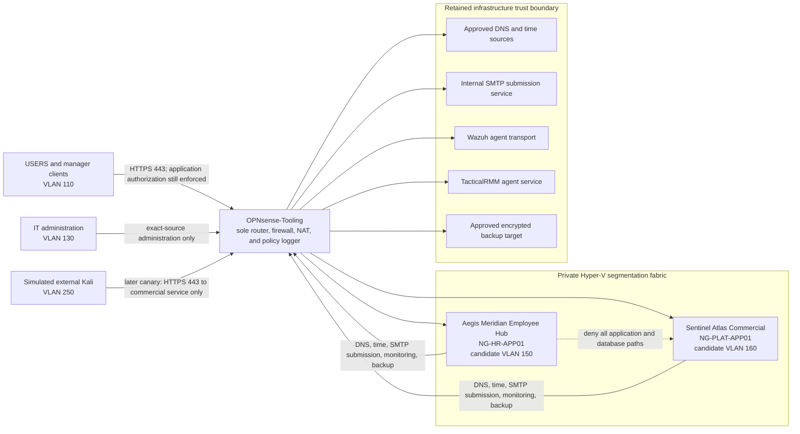

# ADR-0004: Independent Debian application services

- **Status:** Proposed; plan-only
- **Date:** 2026-08-01
- **Scope:** Aegis Meridian Employee Hub and Sentinel Atlas Commercial application hosting

## Context

The fictitious Aegis Meridian organization needs two independently developed and operated services:

- **Aegis Meridian Employee Hub**, an internal HR application for lab employees; and
- **Sentinel Atlas Commercial**, the customer-facing platform the company sells.

The applications are separate private monorepos and must not share a release, guest runtime, database, service identity, or guest-level failure domain. Each service therefore requires its own Debian 12 virtual machine. Shared host and infrastructure dependencies remain explicit below. The VM Factory remains plan-only: apply is disabled; the hash-pinned Debian image, application network/storage/recovery/access profiles, and role bootstraps are proposed rather than promoted or approved; and no standard workload manifest exists. This decision records intent without authorizing a Hyper-V, OPNsense, DNS, SMTP, Wazuh, TacticalRMM, backup, guest, or application change.

This decision uses a dedicated private application fabric rather than extending or exposing the existing external LAN switch. The target is `NorthGate-App-Trunk`, with a dedicated OPNsense `APP-TRUNK` adapter carrying VLANs 150 and 160 and access-mode workload adapters resolved through opaque profiles. The design requires a separate guarded control-plane change, updated immutable switch/trunk policy, OPNsense configuration backup, and new negative tests; it does not amend live fabric or authorize routine VM provisioning to create or rebind network infrastructure.

## Decision

Use one Generation 2 Debian 12 host per service. Keep the application, local database, and reverse proxy for a service on its assigned VM during this lab phase. No database listener is routed between zones. Promote each application artifact and each VM independently; a failure or rollback for one service must not change the other.

The proposed identities are `NG-VM-016` / `NG-HR-APP01` for Employee Hub and `NG-VM-017` / `NG-PLAT-APP01` for Sentinel Atlas. **These IDs and names are planning candidates, not protected-ledger reservations.** A fresh collision check across the ledger, live Hyper-V, DNS, DHCP, Wazuh, TacticalRMM, and Operation-SeeSaw is required before either may be approved.

Employee Hub handles synthetic HR records and is internal-only. Sentinel Atlas uses synthetic customer and tenant data and is reachable from approved trusted clients plus a later, source-restricted simulated-external HTTPS path. Neither application is exposed to the physical WAN in this plan.

## Architecture and trust boundaries

Candidate network intent is:

| Zone | Candidate network | Candidate service address | Policy intent |
| --- | --- | --- | --- |
| `BUSINESS-APPS` | VLAN 150 / `10.10.150.0/24` | Employee Hub at `10.10.150.10` | Internal HTTPS only; deny SIM-WAN, commercial application, and direct management-plane access |
| `COMMERCIAL-DMZ` | VLAN 160 / `10.10.160.0/24` | Sentinel Atlas at `10.10.160.10` | HTTPS from reviewed internal clients and, after a separate canary, the exact simulated-external source; deny physical-WAN publication |

These values are not IPAM reservations. The networks, addresses, OPNsense interfaces, rules, DNS records, and host-policy fingerprints require separate approval and live conflict checks. Proposed DNS names use test-only namespaces: `employees.aegismeridian.test` and `app.sentinelatlas.test`. No public DNS record is part of this decision.

## Workload and release boundaries

- Each private application monorepo produces its own immutable, versioned release with dependency inventory, test results, provenance, digest, and rollback artifact. A branch name or moving tag is not deployable identity.
- The VM Factory consumes only approved VM intent. It does not execute either application checkout or accept application secrets.
- Each guest runs dedicated non-login service identities, a TLS reverse proxy, the application, and its local database. Application and database services bind only to loopback or an internal socket; only the reverse proxy publishes HTTPS.
- Because the `.test` names are not publicly certifiable, each service uses a separate private-CA-issued certificate or an explicitly approved pinned certificate. The deployment change must distribute trust to only the approved Windows and Kali canary clients, keep private keys distinct, prove renewal and revocation, record expiry, and retain a tested trust/certificate rollback.
- Secrets, TLS private keys, SMTP credentials, database credentials, Wazuh enrollment material, TacticalRMM tokens, and recovery keys are injected through a protected human-controlled or installed deployment path. They never enter Git, manifests, TacticalRMM arguments/environment, chat, logs, or evidence notes.
- Restricted HR fields, customer content, session tokens, message bodies, and database queries are excluded from application and Wazuh logs. Security telemetry is limited to identity, authorization outcome, service health, configuration integrity, and bounded request metadata.

## Promotion requirements

Before a consuming manifest is authored, independently promote:

1. an immutable Debian 12 amd64 image with verified upstream signature, exact digest, support status, Generation 2 boot, Secure Boot behavior, clean package baseline, no embedded identity or secret, and a reproducible rebuild path;
2. host-validated `BUSINESS-APPS` and `COMMERCIAL-DMZ` network mappings, including immutable switch identity, access VLAN, OPNsense interface, default-deny policy, DNS, and negative tests;
3. secret-safe role bootstrap profiles for the Employee Hub and Sentinel Atlas hosts, covering OS hardening, key-only source-restricted administration, service identities, firewall, patching, application artifact verification, logging, Wazuh, the owner-accepted TacticalRMM Linux agent or documented native-health fallback, and recovery hooks;
4. suitable owner, Linux firmware, persistent storage, and recovery profiles, with explicit eligibility for the approved criticality and data classification; and
5. the application release artifact separately from the base image, bootstrap profile, catalog release, and first consuming manifest.

Catalog promotion and the first workload consuming a promoted reference cannot share one deployment approval.

## Security and operational consequences

The two-host design prevents an HR compromise or application rollback from directly changing the commercial platform, and the routed zones make cross-service access observable and enforceable. It costs additional memory, storage, patching, backup, and monitoring capacity on the single Hyper-V host. OPNsense, the retained DNS/time services, Wazuh, TacticalRMM, SMTP, and backup storage remain shared dependencies and must be included in availability and recovery testing.

Restricted HR data may not enter Employee Hub until encryption at rest, recovery-key custody, access review, backup, isolated restore, and deletion/retention behavior pass. Sentinel Atlas may not receive simulated-external access until its internal canary, TLS, authorization, rate-limit, Wazuh, and boundary-negative tests pass. Physical-WAN publication is a separate future decision.

## Rejected alternatives

- One VM or shared database for both applications.
- One combined monorepo, release, service identity, or rollback unit.
- Hosting Employee Hub on the USERS or retained infrastructure LAN.
- Putting Sentinel Atlas directly on SIM-WAN or the physical external switch.
- Deploying an application from a Git checkout, mutable tag, or unsigned/unhashed artifact.
- Creating manifests before identity, governance, image, network, bootstrap, storage, recovery, and application-release references are approved.

The operator gate, candidate schema envelopes, canary order, acceptance tests, and recovery contract are in the [Aegis application deployment plan](../aegis-application-deployment-plan.md).
