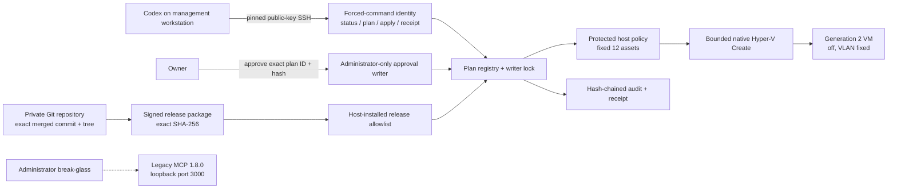

# ADR-0005: Dedicated forced-command create-only release

- **Status:** Accepted for release engineering; live promotion pending
- **Date:** 2026-08-02
- **Scope:** Routine NorthGate VM creation for the approved 12-asset fleet

## Context

The live NorthGate MCP 1.8.0 service exposes read-only inventory and broad break-glass mutations on different URL paths of one loopback port. The forwarding-only SSH identity restricts the destination port, not the HTTP path, so it cannot enforce a create-only application role. The current private GitHub account also does not provide branch protection for private repositories. Making the repository public or treating an unprotected moving branch as deployment authority is unacceptable.

Codex supports environment-sourced bearer tokens for HTTP MCP servers, but it does not natively retrieve an arbitrary bearer secret from Windows Credential Manager. A securely reviewed process-only secret launcher does not yet exist in this environment. The existing source-restricted public-key SSH pattern is already deployed and understood.

## Decision

Use a separate, source-restricted SSH application identity whose server-side forced command exposes exactly four operations:

- `status`
- `plan`
- `apply ngp-<64-lowercase-hex>`
- `receipt ngp-<64-lowercase-hex>`

The identity has no interactive shell, PTY, forwarding, agent forwarding, X11, subsystem, environment override, or arbitrary command route. `plan` accepts only a bounded fixed asset identifier. `apply` accepts only a host-issued plan ID and succeeds only after a separate Administrator-only approval writer has recorded the exact plan ID and authenticated plan hash.

The local named-pipe service additionally accepts four operations that the routine SSH
identity cannot authorize: `approval-context`, `approve`, `rollout-context`, and
`promote-rollout`. The last two support only the two monotonic same-release transitions
`debian-canary` to `windows-canary` to `persistent-fleet`. Each transition is bound to
the verified signed canary receipt, independent acceptance and retirement evidence,
the exact release/policy/data/repository hashes, a native Administrator SID, a short
expiry, and a detached CMS signature from the pinned non-exportable approval key.
The immutable base policy is not edited; an HMAC-protected current anchor and immutable
CMS-signed/HMAC-protected promotion history carry the effective rollout state.

The installed release resolves all storage, source-image, asset-bound derivative ISO,
switch, VLAN, firmware, and bootstrap values from ACL-protected signed policy and data.
Callers cannot submit paths, switch names, VLANs, URLs, scripts, or PowerShell. Every
plan contains one typed `Create` operation. Created VMs are Generation 2 and destroy
protected; the transaction may start only its newly created VM, after configuration
readback, when the exact approved manifest requests `running`. No standalone start,
stop, update, replace, adopt, decommission, delete, purge, switch, firewall,
guest-command, or general execution operation is registered.

The broad MCP 1.8.0 endpoint remains available only to the separate Administrator break-glass path. Before routine create-only activation, the existing forwarding identity must lose access to port 3000. Read-only discovery may later move to a separately authenticated read-only service, but it is not allowed to delay removal of the broad routine tunnel.

## Repository trust compensating control

Private-repository branch protection is unavailable on the current GitHub tier. The compensating control is content-addressed and fail-closed:

1. Human review and merge still establish intent.
2. Packaging requires the canonical repository origin, a clean exact `HEAD`, and the
   commit-derived tree, then extracts the fixed allowlist directly from raw Git blobs.
3. The canonical manifest binds every path to its Git mode, blob OID, SHA-256, size,
   package-allowlist hash, release identity, and governance decision.
4. A reviewed one-time bootstrap installer, generated outside Git with only exact
   public certificate SHA-256 pins substituted, must verify every required detached
   CMS signature before any package file is imported or executed.
5. The installer verifies those exact values and installs immutable bytes; it never
   executes a checkout.
6. A moving branch, tag name, GitHub release name, or client-computed manifest hash is never deployment authority.
7. Reuse of an older allowed release is blocked by host promotion state.

This exception requires review as its own governance change. It does not relax the separate host-issued plan approval.

## Storage and rollout boundary

Environment-specific paths, volume identities, switch fingerprints, media locations, and addresses remain outside Git. The installed host policy must split the 900 GiB persistent disk ceiling across both approved Hyper-V volumes and permit only one disposable canary at a time. Capacity, media hashes, switch identity, collision state, maintenance state, and the release/policy hashes are revalidated while holding the host writer lock immediately before creation.

The first executable stage is the Debian disposable canary only. A signed same-release
promotion may advance to the Windows canary only when it carries the exact Debian
receipt, independent acceptance, and retirement evidence hashes and live readback
confirms the canary is absent or off and disconnected. Persistent `Create` remains
blocked until a second signed same-release promotion carries the equivalent Windows
evidence while preserving the accepted Debian record. The immutable base policy stays
unchanged; every effective stage enforces the fixed asset order and one nonterminal
transaction.

## Failure and recovery behavior

- Existing VM name, identity, disk, or path collision is a hard stop; there is no implicit adoption.
- A stale, expired, unapproved, reused, or state-mismatched plan is rejected.
- Audit, registry, approval-verification, lock, media, or receipt failure before mutation is fail-closed.
- After the irreversible boundary, ambiguous results become `OutcomeUnknown`; asset and name reuse are blocked.
- An ambiguous transaction-owned VM is forced off, disconnected, marked, and quarantined; retained VMs are never touched.
- Only transaction-marked new artifacts may enter quarantine. The operator never deletes by supplied name or path.
- Control-plane rollback removes the create-only identity and release but never deletes a VM already created.
- The five retained VMs are outside every candidate transaction and rollback scope.

## Promotion sequence

1. Merge and pin the design and release source without activation.
2. Review the exact release commit/tree and package hash.
3. Back up MCP 1.8.0, scheduled tasks, SSH configuration, tunnel configuration, and host policy state.
4. Install the release, identity, keys, ACLs, registry, ledger, audit, approval writer, and rollback package with apply disabled.
5. Prove command denial, source restriction, no broad MCP reachability, ACLs, lock, expiry, collision, capacity, media, switch, audit, failure injection, and rollback.
6. Promote only Debian canary `Create`, issue a fresh host plan, and request separate approval of its exact ID and hash.

No step combines release installation, policy promotion, first consuming request, and plan approval.

## Consequences

This path uses mature source-restricted public-key authentication and removes routine exposure to the broad MCP endpoint. It adds an installer, fixed host policy, forced-command dispatcher, approval signer/verifier, crash journal, ledger, audit chain, receipt, and rollback package that must be tested and promoted independently. OAuth-backed MCP may replace the forced-command transport later without changing the plan, approval, policy, or Hyper-V transaction contracts.
