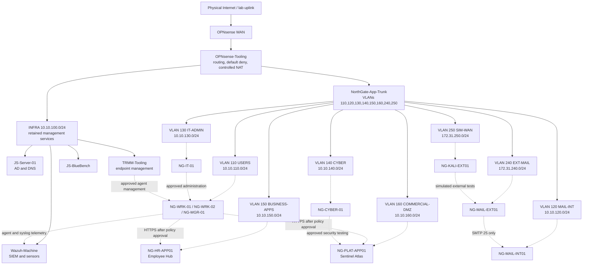

# NorthGate full-fleet foundation plan

## Status and boundary

This document and the strict [full-fleet proposal](../proposals/full-fleet.proposed.json) record a 12-VM design: two disposable canaries and ten persistent workloads. They are **plan-only**. They do not reserve an identity or address, register DNS, create a DHCP mapping, promote an image or profile, enable apply, issue a host plan, change OPNsense, or create a VM.

Standard `VirtualMachine` manifests are intentionally absent. The proposal remains blocked while the control plane is unpromoted, the private repository has no enforceable protected-branch rules on its current GitHub plan, catalog prerequisites are proposed, candidate identities and changes are unapproved, and network reservations are unallocated. The owner-authorized Kali 2026.2 installer is now present on the host, matched to the official signed checksum, and recorded as a proposed immutable catalog entry, but it remains unpromoted until its Generation 2, Secure Boot, clean-baseline, bootstrap, and rollback acceptance gates pass. The reduced maximum-memory envelope now clears the design-time reserve check but remains subject to fresh host-plan revalidation. Each prerequisite is promoted separately before the first standard manifest consumes it. Before merge can become a deployment gate, enable branch protection on a supporting GitHub plan or approve a separately documented signed-promotion compensating control; repository ownership alone is not equivalent protection.

## Fleet map

| Order | Candidate asset and VM | Class | Opaque network profile | Proposed fixed service identity | Assignment method | DNS intent |
| ---: | --- | --- | --- | --- | --- | --- |
| 1 | `NG-VM-018` / `NG-DEB-CAN01` | Disposable Debian canary | `business-apps` | No durable address | One time-bounded, collision-checked bootstrap mapping; remove on canary retirement | No durable record |
| 2 | `NG-VM-010` / `NG-CANARY-01` | Disposable Windows canary | `users-workstations` | No durable address | One time-bounded, collision-checked bootstrap mapping; remove on canary retirement | Temporary record only if domain testing requires it; remove on retirement |
| 3 | `NG-VM-019` / `NG-MAIL-EXT01` | Persistent simulated-external mail | `external-mail` | `172.31.240.10` | Guest static after final NIC identity and collision readback | `mail.redteam.test`; matching PTR |
| 4 | `NG-VM-020` / `NG-MAIL-INT01` | Persistent internal mail | `mail-internal` | `10.10.120.10` | Guest static after final NIC identity and collision readback | `mail.northgate.test`; `northgate.test` MX; matching PTR |
| 5 | `NG-VM-011` / `NG-WRK-01` | Persistent worker | `users-workstations` | `10.10.110.20` | OPNsense fixed mapping bound to the final host-approved static MAC | `ng-wrk-01.northgate.tooling`; matching PTR |
| 6 | `NG-VM-012` / `NG-WRK-02` | Persistent worker | `users-workstations` | `10.10.110.21` | OPNsense fixed mapping bound to the final host-approved static MAC | `ng-wrk-02.northgate.tooling`; matching PTR |
| 7 | `NG-VM-013` / `NG-MGR-01` | Persistent manager | `users-workstations` | `10.10.110.22` | OPNsense fixed mapping bound to the final host-approved static MAC | `ng-mgr-01.northgate.tooling`; matching PTR |
| 8 | `NG-VM-014` / `NG-IT-01` | Persistent IT administration | `it-admin-workstations` | `10.10.130.20` | OPNsense fixed mapping bound to the final host-approved static MAC | `ng-it-01.northgate.tooling`; matching PTR |
| 9 | `NG-VM-015` / `NG-CYBER-01` | Persistent cyber operations | `cyber-workstations` | `10.10.140.20` | OPNsense fixed mapping bound to the final host-approved static MAC | `ng-cyber-01.northgate.tooling`; matching PTR |
| 10 | `NG-VM-016` / `NG-HR-APP01` | Persistent Employee Hub | `business-apps` | `10.10.150.10` | Guest static after final NIC identity and collision readback | `employees.aegismeridian.test`; matching PTR |
| 11 | `NG-VM-017` / `NG-PLAT-APP01` | Persistent Sentinel Atlas | `commercial-dmz` | `10.10.160.10` | Guest static after final NIC identity and collision readback | `app.sentinelatlas.test`; matching PTR |
| 12 | `NG-VM-021` / `NG-KALI-EXT01` | Persistent simulated-external test host | `sim-wan` | `172.31.250.10` | OPNsense fixed mapping bound to the final host-approved static MAC | `kali-ext.redteam.test`; matching PTR |

The exact address and DNS set remains proposed and unallocated until a fresh collision check passes across OPNsense, DHCP, DNS, routes, ARP/neighbor state, Hyper-V adapters, the protected identity ledger, Wazuh, TacticalRMM, and Operation-SeeSaw. A quiet ping is not reservation evidence. VM manifests carry only the opaque network profile; VLANs, addresses, DNS names, MACs, gateways, and switch identities remain outside that contract.

## Architecture map

Solid infrastructure nodes and VLAN gateways are present; dashed workload links remain planned until their individual factory plans are approved and verified.

## VLAN and reservation sequence

| Zone | VLAN | Network and gateway | Planned consumers | Repository state |
| --- | ---: | --- | --- | --- |
| `USERS` | 110 | `10.10.110.0/24`; `10.10.110.1` | Windows canary, two workers, manager | Gateway live and default-deny; workload policy and reservations remain unpromoted |
| `MAIL-INT` | 120 | `10.10.120.0/24`; `10.10.120.1` | Internal mail | Gateway live and default-deny; workload policy and reservations remain unpromoted |
| `IT-ADMIN` | 130 | `10.10.130.0/24`; `10.10.130.1` | IT workstation | Gateway live and default-deny; workload policy and reservations remain unpromoted |
| `CYBER` | 140 | `10.10.140.0/24`; `10.10.140.1` | Cyber workstation | Gateway live and default-deny; workload policy and reservations remain unpromoted |
| `BUSINESS-APPS` | 150 | `10.10.150.0/24`; `10.10.150.1` | Debian canary, Employee Hub | Gateway live and default-deny; workload policy and reservations remain unpromoted |
| `COMMERCIAL-DMZ` | 160 | `10.10.160.0/24`; `10.10.160.1` | Sentinel Atlas | Gateway live and default-deny; workload policy and reservations remain unpromoted |
| `EXT-MAIL` | 240 | `172.31.240.0/24`; `172.31.240.1` | External mail and inbound edge VIP | Gateway live and default-deny; workload policy and reservations remain unpromoted |
| `SIM-WAN` | 250 | `172.31.250.0/24`; `172.31.250.1` | Kali | Gateway live and default-deny; workload policy and reservations remain unpromoted |
| `NATIVE-SINK` | 4094 | No interface, address, route, DHCP, or DNS | No workload | Host-validated sink only; untagged traffic must fail |

Use this serialized reservation transaction for each persistent VM:

1. Reconcile the candidate asset ID, canonical name, network, fixed address, DNS names, and requested role against live state and the protected identity ledger.
2. Approve the asset and change record, then reserve the identity in the protected ledger. This Git proposal never performs that reservation.
3. Promote the exact image and every opaque profile in a separate reviewed catalog/control-plane release.
4. Generate and merge one standard manifest only after those prerequisites are active.
5. Obtain a fresh host-issued plan and exact human approval; create only the VM and its factory-owned adapter/artifacts.
6. Read back the final host-approved static MAC. In a separate network reservation change, create the fixed mapping or guest-static record and forward/reverse DNS, then verify uniqueness and role policy.
7. Verify gateway, DNS, time, role-specific service paths, negative paths, Wazuh, TacticalRMM where supported, recovery, and signed evidence before advancing.

Canaries use temporary identities and never receive a durable production reservation. Their desired power state is `running` so the single approved canary `Create` plan can exercise boot, bootstrap, monitoring, quarantine, and receipt acceptance without invoking a direct lifecycle mutator. Only one canary exists at a time, and both are retired through the separately approved canary cleanup path before the persistent fleet is considered complete.

## Capacity gate

The ten persistent VMs request 28 assigned vCPUs, 50 GiB startup memory, 90 GiB configured maximum memory, and 900 GiB of OS-disk ceilings. The largest disposable canary adds 2 vCPU, 4 GiB startup, 8 GiB maximum, and 80 GiB disk while it exists.

The original 104 GiB persistent maximum would have breached the 48 GiB host-reserve rule by 8,448 MiB at the last normalized read. The owner-authorized full-fleet sizing decision instead caps each worker and manager at 6 GiB and each IT and Cyber workstation at 12 GiB. That removes 14,336 MiB from configured maxima and leaves a 5,888 MiB margin above the policy reserve at that snapshot without weakening the reserve. This closes the design-time capacity blocker, but every fresh host plan must recompute retained VM ceilings, checkpoints, physical availability, and host overhead. Canaries still may not overlap the completed persistent fleet unless the fresh plan proves the reserve.

## Kali image promotion gate

`NG-VM-021` now names the proposed, non-consumable image reference `kali-2026.2-installer-netinst-amd64`. The owner-authorized artifact is staged at `D:\HyperV\VM-ISO\kali-linux-2026.2-installer-netinst-amd64.iso`, with exact size `779091968` bytes and SHA-256 `d32f929dacc48134a31461a09f2160d13ad1d26b820cee920446813ca979b39b`. Its checksum was matched to Kali's officially signed checksum file using signing-key fingerprint `827C8569F2518CC677FECA1AED65462EC8D5E4C5`. This proves artifact identity, not VM suitability: the catalog entry remains proposed and cannot be consumed until Generation 2 and Secure Boot behavior, a clean baseline, bootstrap compatibility, recovery, and rollback are tested and the exact image is separately promoted. Kali remains last in the rollout.

## Promotion units

The safe sequence is: control-plane and negative-test acceptance; Debian canary prerequisites and disposable request; Debian canary acceptance and retirement; Windows image/vTPM/bootstrap prerequisites; Windows canary acceptance and retirement; shared network policy; external mail; internal mail; three ordinary/manager workstations; IT; Cyber; Employee Hub; Sentinel Atlas; and Kali only after its separate image gate. Every persistent VM receives its own merged manifest, fresh host-issued plan, exact plan approval, receipt, and Operation-SeeSaw reconciliation.
